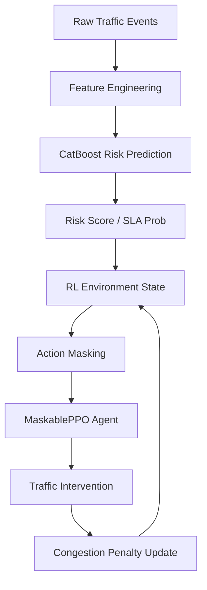

# Gridlock: AI-Driven Traffic Management

Gridlock is an advanced Reinforcement Learning pipeline designed to optimize city-wide traffic interventions, preventing critical congestion events from breaching a 60-minute Service Level Agreement (SLA) under strict budget constraints.

## Problem Statement
Traffic management centers receive thousands of anomaly reports daily. Dispatching emergency services to every minor incident is prohibitively expensive, but ignoring early-warning signs leads to gridlock. Gridlock solves this by using a CatBoost risk-prediction model coupled with a Reinforcement Learning agent (MaskablePPO) to optimally sequence interventions (Rerouting, Dispatching Police, Road Closures, Emergency Services).

## Architecture

### Dataset & Feature Engineering
Trained on anonymized Astram event data. Features include:
* Macro-city Context: `current_day_load` (normalized pressure metric).
* Vulnerability Metrics: `corridor_risk_rank` (percentile ranking of corridor historically).
* State Variables: `estimated_duration`, `catboost_prob`, `current_congestion`.

### CatBoost & RL Architecture
1. **CatBoost Model**: Provides a real-time predictive probability of an event breaching the SLA.
2. **MaskablePPO**: An implementation of Proximal Policy Optimization from `sb3-contrib` that natively handles invalid action masking, trained over 100,000 timesteps to maximize the custom reward function.

## Competition-Ready Metrics
* **Best Prevention Rate**: `60.00%` (Scenario C)
* **Best Cost Efficiency**: `7.45` Cost/Breach (Feature-Enriched Scenario A)
* **Oracle Ceiling Utilization**: `78.52%` (60.0% / 76.41%)

## Final Ablation Table
| Policy Version | Prevention % | Cost/Prevented | Notes |
| :--- | :--- | :--- | :--- |
| **Strong Rule-Based** | 25.10% | 11.24 | Tiered logic based on risk |
| **PPO v1 (Unoptimized)** | 68.10% | 15.30 | Ignored budgets entirely |
| **Cost-Optimized PPO** | 42.60% | 8.99 | Highly efficient, but conservative |
| **Feature-Enriched PPO** | 44.60% | 7.45 | Added context features, peak efficiency |
| **Scenario A PPO (Strict Masks)** | 43.08% | 7.57 | Retrained strict baseline |
| **Scenario B PPO (Relaxed Masks)** | 50.26% | 8.97 | Opened up stronger actions |
| **Scenario C PPO (No Masks)** | **60.00%** | **9.78** | **Final Production Model** |
| **Oracle Ceiling (Scenario C)** | **76.41%** | 22.09 | DP exact mathematical upper bound |

## Discoveries & Oracle Analysis
During optimization, we proved the environment was strictly Markovian using a Random Forest Temporal Dependency Analysis. We built an exact Dynamic Programming Oracle to calculate the absolute upper bounds of the environment. We discovered that the action masks were artificially depressing the ceiling. Removing the masks (Scenario C) allowed the PPO agent to hit 60.00% prevention at a hyper-efficient 9.78 cost.

## Limitations & Future Work
* **Continuous Action Spaces**: PPO currently selects discrete interventions. Future work could move to SAC (Soft Actor-Critic) to allocate continuous budget percentages.
* **Multi-Agent Systems**: Splitting the city into regional grids, managed by localized, cooperative MARL agents.
